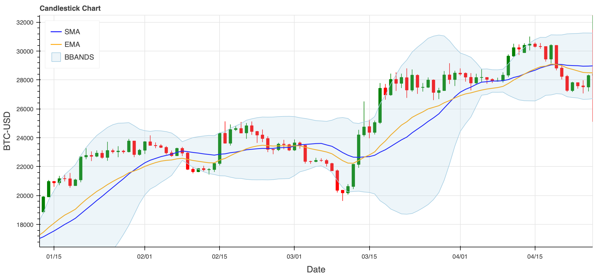

# Advanced Technical Analysis

This repository provides a collection of conventional and experimental technical indicators, combining widely-used market tools with advanced scientific calculations. These indicators might offer a fresh perspective on market dynamics, incorporating concepts from complexity science, chaos theory, fractal analysis, and recurrence quantification analysis. The repository includes both static plots (Matplotlib) and interactive visualizations (Bokeh) to allow for in-depth exploration and analysis.



## Features

### Conventional Indicators

This collection includes widely-used technical indicators to analyze market.

#### Trend Indicators
- **Simple Moving Average (SMA)**: Calculates the arithmetic mean of prices over a specified period. Used to identify trend direction and potential support/resistance levels. Smoother than price action but lags behind current price.
- **Exponential Moving Average (EMA)**: Similar to SMA but assigns more weight to recent prices. Responds more quickly to price changes than SMA. Commonly used in MACD and other complex indicators.
- **Moving Average Convergence Divergence (MACD)**: Consists of MACD line (difference between fast and slow EMAs). Includes signal line (EMA of MACD line) and histogram. Used to identify trend changes and momentum.
- **Parabolic SAR (Stop And Reverse)**: Plots points that indicate potential trend reversals. Provides explicit entry and exit signals. Particularly useful in trending markets.

#### Volatility Indicators
- **Bollinger Bands (BB)**: Consists of three bands: middle (SMA) and two outer bands. Outer bands represent standard deviations from the middle band. Helps identify volatility expansions/contractions and potential price extremes.
- **Average True Range (ATR)**: Measures market volatility based on price ranges. Accounts for gaps between trading sessions. Often used for position sizing and stop-loss placement.

#### Momentum Indicators
- **Relative Strength Index (RSI)**: Oscillator that measures speed and magnitude of price movements. Ranges from 0 to 100. Traditional overbought/oversold levels at 70/30.
- **Stochastic Oscillator (STOCH)**: Compares closing price to high-low range over time. Consists of %K (fast) and %D (slow) lines. Helps identify potential reversal points.
- **Williams %R**: Similar to Stochastic Oscillator but inverted. Ranges from -100 to 0. Shows overbought/oversold conditions relative to look-back period.
- **Momentum**: Measures rate of change in price movements. Helps identify trend strength and potential reversals. Can be used with various time periods.
- **Commodity Channel Index (CCI)**: Measures current price relative to average price. Identifies cyclical turns in price. Used for both trend following and counter-trend strategies.

#### Volume-Based Indicators
- On-Balance Volume (OBV): Cumulative total of volume with direction based on price movement. Used to confirm price trends. Shows potential divergences between price and volume.

### Scientific Indicators

In addition to conventional tools, this repository includes advanced metrics that apply scientific principles.

- Entropy: Quantifies uncertainty or disorder in price movements, offering insight into market unpredictability.
- Mutual Information: Measures the dependency between time-series data points to reveal hidden relationships within the price series.
- Multifractal Analysis: Identifies scaling behaviors in time-series data, uncovering patterns that emerge across different time horizons.
- Recurrence Quantification Analysis (RQA): Detects the recurrence of states in a system, helping to uncover hidden patterns or chaotic behavior in the market.
- Complexity Measures: Includes methods such as Lempel-Ziv complexity to gauge the randomness and structural complexity within time-series data.
- Lyapunov Exponent: A chaos indicator that quantifies the sensitivity of the system to initial conditions, helping to detect chaotic or stable behavior.

#### Information Theory Based

- **Entropy**: Measures the randomness and unpredictability in price movements. Higher values indicate more disorder/uncertainty in the market.  

        Types implemented:
        - Shannon Entropy: Classical measure of information content
        - Approximate Entropy: More robust to noise than Sample Entropy  
    
        Applications:
        - Market regime detection
        - Volatility forecasting
        - Risk assessment
    <br>
- **Mutual Information**: Quantifies the mutual dependence between different time series. Measures how much information one variable provides about another.

        Applications:
        - Cross-market analysis
        - Lead-lag relationships
        - Market coupling strength estimation

        Features:
        - Time-delayed mutual information for temporal dependencies
        - Cross-mutual information for multi-market analysis

#### Fractal Analysis

- **Multifractal Analysis**: Examines scaling properties across different time scales.

        Components:
        - Multifractal Spectrum: Shows range of scaling behaviors
        - Hurst Exponent: Measures long-term memory
        - Singularity Spectrum: Identifies critical points
        
        Applications:
        - Market efficiency assessment
        - Crisis prediction
        - Trading strategy optimization
    <br>
- **Fractal Dimension**: Quantifies the complexity of price patterns.

        Implementations:
        - Box-counting dimension
        - Correlation dimension
        - Higuchi dimension
        
        Used for:
        - Pattern complexity measurement
        - Market state classification
        - Trend strength assessment

#### Chaos Theory Applications

- **Recurrence Quantification Analysis (RQA)**: Analyzes recurrent patterns in phase space.

        Key Metrics:
        - Recurrence Rate: Overall repetitiveness
        - Determinism: Predictability measure
        - Laminarity: Market stability indicator
        - Entropy: Complexity of recurrent patterns
        
        Applications:
        - Market regime detection
        - Early warning signals
        - Stability analysis
    <br>
- **Lyapunov Exponent**: Measures sensitivity to initial conditions.

        Characteristics:
        - Positive values indicate chaos
        - Negative values suggest stable behavior
        - Zero values indicate periodic behavior
        
        Uses:
        - Market predictability assessment
        - System stability analysis
        - Risk quantification

#### Complexity Measures

- **Algorithmic Complexity**

    - Lempel-Ziv Complexity: Measures randomness through data compression.

            Applications:
            - Market efficiency measurement
            - Pattern detection
            - Regime change identification
        <br>
    - Permutation Entropy: Analyzes ordinal patterns in time series.
 
            Features:
            - Robust to noise
            - Scale-invariant
            - Computationally efficient
            
            Uses:
            - Market microstructure analysis
            - High-frequency trading signals
            - Complexity-based trading strategies

#### Network Theory Extensions

- **Visibility Graph Analysis**: Converts time series to complex networks.

        Metrics:
        - Node degree distribution
        - Clustering coefficient
        - Path length statistics
        
        Applications:
        - Market structure analysis
        - Hidden pattern detection
        - Cross-scale relationships


Each scientific indicator is implemented with:
- Multiple parameter options for customization
- Optimization capabilities for specific market conditions
- Comprehensive statistical validation methods
- Integration with conventional technical indicators
- Advanced visualization options

### Plotting

- Matplotlib (Static): Static charts offer a clear and concise way to visualize indicator values, making it easy to compare various calculations.
- Bokeh (Interactive): Interactive plots enable dynamic exploration of data, allowing users to zoom, pan, and hover over elements to obtain deeper insights into market behavior.

## Installation

Clone the repository:

```
$ git clone https://github.com/your-username/advanced-technical-indicators.git
````

Install the required dependencies:

```
$ pip install -r requirements.txt
```

## Usage

1. Open the Jupyter notebook in the repository to access and customize the indicators.
1. Choose between static (Matplotlib) or interactive (Bokeh) charts for visualization.
1. Customize inputs such as timeframes and indicator parameters, then explore market data through the provided tools.

## Contributing

Contributions are welcome! Please open an issue or submit a pull request to suggest improvements or new features.

## License

This project is licensed under the GNU Affero General Public License (AGPL) v3 for non-commercial and academic use. For commercial use, a separate license agreement is required.

This project is available under a dual-licensing model:

### Academic and Non-Commercial Use

Licensed under GNU Affero General Public License v3.0 (AGPL-3.0)
- ✅ Free to use, modify, and distribute for academic and non-commercial purposes
- ✅ Must maintain open source nature of any modifications
- ✅ Must provide complete source code to users of any network service
- ✅ Modifications must be documented and shared
- ✅ Original copyright and license notices must be retained

### Commercial Use

A separate commercial license is required for commercial applications
- 💼 Enables use in proprietary software
- 💼 No requirement to disclose source code
- 💼 Custom support and development options
- 💼 Contact <artun@mail.com> for licensing terms

For full license details:
- See [LICENSE](LICENSE.md) for AGPL-3.0 terms
- See [COMMERCIAL LICENSE](COMMERCIAL_LICENSE.md) for commercial licensing information